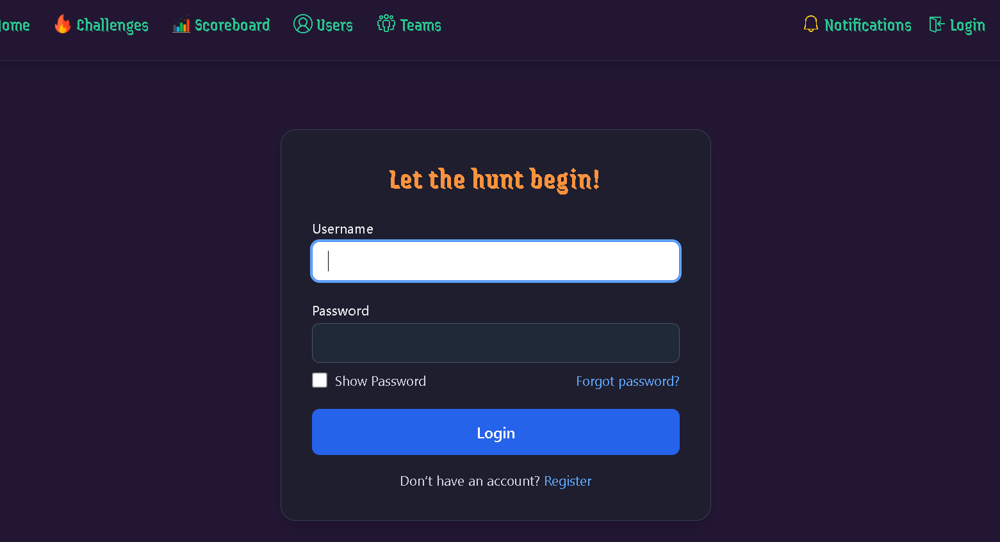
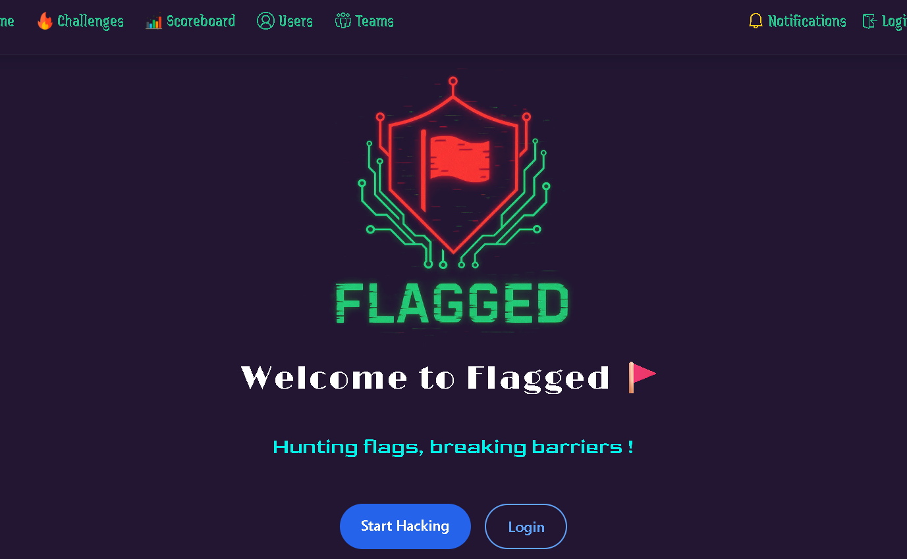
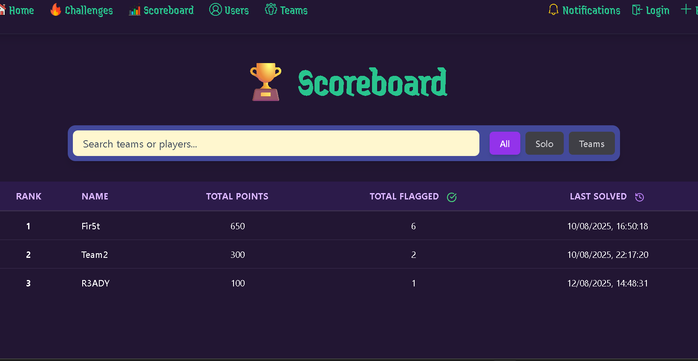
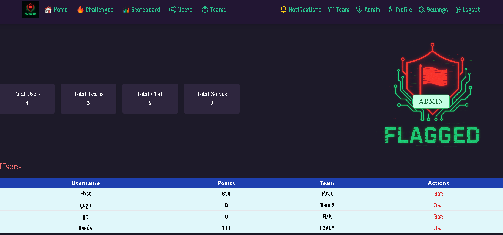

# Flagged – A CTF platform

A modular, API-first platform for managing Capture The Flag (CTF) competitions, built with **FastAPI** (Python) on the backend and **Next.js** (React) on the frontend.  
Developed as part of the IITISoC Cybersecurity project to provide a reliable, user-friendly, and extensible system for CTF event management.

## Table of Contents
- [About](#about)
- [Features](#features)
- [Tech Stack](#tech-stack)
- [Installation and setup](#installation-and-setup)
- [Screenshots](#screenshots)
- [Future Improvements](#future-improvements)
- [Contributors](#contributors)
- [License](#license)

## About 

Capture The Flag competitions are a fun and educational way to test cybersecurity skills.  
Our goal with this project was to create a CTF management platform that:
- Is lightwieght
- Follows API-first architecture
- Has a modern frontend UI
- Supports teams, challenges, scoring, and authentication
- Prioritizes extensibility for future features

The platform is suitable for university-level CTF events, cybersecurity clubs, or even small online competitions.

## Features 

- User & Team Management (Registration, login, management)
- Challenge Management (Static challenges, scoring logic)
- Role-Based Access Control
- API-first design for flexibility (can support mobile/CLI in the future)
- Email verification flows

## Tech Stack 

**Backend**
- FastAPI (with Pydantic models)
- SQLAlchemy ORM
- MariaDB/MySQL (Database)

**Frontend**
- Next.js (React)
- Tailwind CSS

## Installation and setup 

We use uv for python package management and pnpm for node package management. Ensure they are installed. Starting the backend and frontend servers is as simple as running the following commands in respective directories

`uv run fastapi dev`

and

`pnpm dev`

Configure the backend at `backend/app/config.py`.

## Screenshots 

| Login Page | Dashboard | Scoreboard | AdminPanel |
|------------|-----------|------------|------------|
|  |  |  |  |

## Future Improvements 

- Support for instance-based challenges
- Plugin-based architecture for custom features
- Anti-cheating tools and personalized flags
- Mobile app / CLI support
- Detailed analytics for organizers
- Comprehensive documentation

## Contributors 

- Tanish Yadav
- Akarsh Raj
- Subhanshu Kumar
- Vivek Sahu
- Sumit Modanwal
- Mohd Hassan Raza Ansari

## License 

This project is licensed under the MIT License - see the LICENSE file for details.
